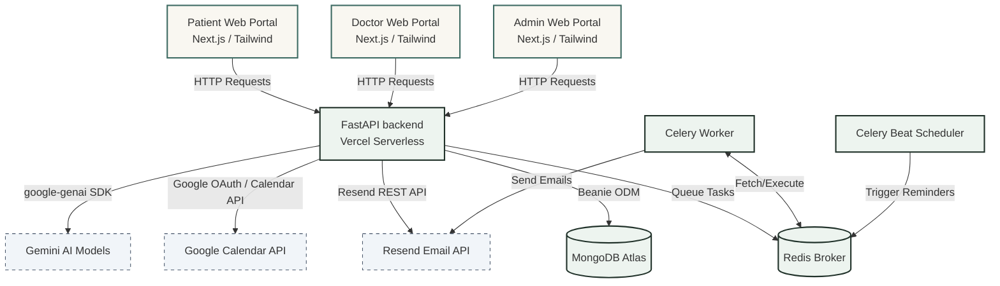

# 🏥 CareConnect - Doctor Appointment & Care Platform

[](https://where-s-my-doctor.vercel.app/)
[](https://fastapi.tiangolo.com)
[](https://nextjs.org)
[](https://www.mongodb.com)

**CareConnect** (Where's My Doctor) is an end-to-end healthcare coordination platform connecting Patients, Doctors, and Administrators. Features include symptom analysis, automated doctor-matching suggestions, appointment booking, AI-generated intake summaries, post-visit documentation, Google Calendar synchronization, and resilient email notification pipelines.

🔗 **Production Live Link:** [https://where-s-my-doctor.vercel.app/](https://where-s-my-doctor.vercel.app/)

---

## 🏛️ System Architecture

The application is built on a decoupled frontend/backend structure, integrating serverless deployments with background worker scheduling.



---

## 🚀 1. Setup Guide

### Local Development Setup

#### Prerequisites
* **MongoDB** (Local or Atlas)
* **Redis** (for Celery broker and result backend)
* **Python 3.10+**
* **Node.js 18+**

#### Step 1: Clone and Configure Environment Files
Create a copy of `.env.example` in `backend/.env`:
```bash
cp .env.example backend/.env
```
Fill in the credentials for MongoDB, Google Client ID, client secret, Resend API key, and Gemini API key.

#### Step 2: Install Backend Dependencies & Run API
```bash
cd backend
python3 -m venv .venv
source .venv/bin/activate
pip install -r requirements.txt
uvicorn app.main:app --reload --host 0.0.0.0 --port 8000
```
The API Swagger documentation will be available at `http://localhost:8000/docs`.

#### Step 3: Run Celery Worker & Beat Scheduler
Open a new terminal tab, activate the virtual environment, and run:
```bash
cd backend
source .venv/bin/activate
# Start worker
celery -A app.celery_app worker -l info
# In another tab, start beat schedule
celery -A app.celery_app beat -l info
```

#### Step 4: Install Frontend Dependencies & Run Next.js
```bash
cd frontend
npm install
npm run dev
```
Open `http://localhost:3000` to access the web application.

---

## ⚙️ 2. Environment Configuration (`.env.example`)

```env
APP_NAME="Appointment Care"
MONGODB_URI="mongodb+srv://<username>:<password>@<cluster>.mongodb.net/?appName=healthcare"
MONGODB_DATABASE_NAME="appointment_care"

JWT_SECRET_KEY="your_32_or_64_character_jwt_secret_key"
JWT_ALGORITHM="HS256"
ACCESS_TOKEN_EXP_MINUTES=15
REFRESH_TOKEN_EXP_DAYS=30

GOOGLE_CLIENT_ID="your_google_oauth_client_id.apps.googleusercontent.com"
GOOGLE_CLIENT_SECRET="your_google_oauth_client_secret"
GOOGLE_REDIRECT_URI="http://localhost:8000/calendar/google/callback"
GOOGLE_AUTH_REDIRECT_URI="http://localhost:8000/auth/google/callback"
FRONTEND_URL="http://localhost:3000"
GOOGLE_TOKEN_ENCRYPTION_SECRET="your_32_character_token_encryption_secret"

RESEND_API_KEY="your_resend_api_key"
RESEND_FROM_EMAIL="noreply@yourdomain.com"

CELERY_BROKER_URL="redis://localhost:6379/0"
CELERY_RESULT_BACKEND="redis://localhost:6379/0"

GEMINI_API_KEY="your_gemini_api_key"
```

---

## 📊 3. Database Schema (MongoDB / Beanie)

* **Users (`users`):** Stores user registration details, credentials hashes, and active roles (`patient`, `doctor`, `admin`).
* **Doctor Profiles (`doctor_profiles`):** Stores doctor specialisation, weekly availability schedule, custom slot duration, and leave days.
* **Appointments (`appointments`):** Manages appointment time intervals, status transitions (`held`, `booked`, `completed`, `cancelled`), and linked Google Calendar event IDs for both patient and doctor.
* **Symptom Intake Forms (`symptom_forms`):** Tracks the symptom intake details submitted by patients and the pre-visit summary metadata parsed by Gemini.
* **Visit Notes (`visit_notes`):** Holds clinical documentation, diagnosis, prescriptions, and post-visit plans.
* **Google Calendar Credentials (`google_calendar_credentials`):** Encrypted OAuth credentials and refresh tokens linked to user IDs.
* **Notification Logs (`notification_logs`):** Audit outbox tracking email notification statuses, sending attempts, and gateway error messages.

---

## 🔌 4. API Endpoints

### Authentication (`/auth`)
* `POST /auth/register`: Public registration (restricted to `patient` and `doctor` roles)
* `POST /auth/login`: Issue access/refresh tokens
* `POST /auth/refresh`: Refresh JWT access token
* `POST /auth/google`: Log in/Register using Google ID Token

### Patients (`/patients`)
* `POST /patients/booking-sessions`: Starts a symptom analysis booking session
* `GET /patients/booking-sessions/{session_id}`: Retrieve session status and AI intake summary
* `POST /patients/booking-sessions/{session_id}/hold`: Holds an appointment slot
* `POST /patients/booking-sessions/{session_id}/confirm`: Finalizes booking, creates GCal events and sends emails
* `POST /patients/appointments/{id}/cancel`: Cancel booking, delete GCal events, notify both parties
* `POST /patients/appointments/{id}/symptoms`: Submit post-hold symptom form details
* `GET /patients/appointments`: Retrieve patient appointment history

### Doctors (`/doctors`)
* `GET /doctors/schedule`: Retrieve working hours, slot duration, and leave configurations
* `PUT /doctors/schedule`: Update working hours/leave days
* `POST /doctors/complete-profile`: Onboard new doctor profile details
* `GET /doctors/appointments`: View upcoming appointments
* `POST /doctors/appointments/{id}/notes`: Submit visit notes, diagnosis, prescriptions; triggers post-visit AI summary tasks

### Admin (`/admin`)
* `GET /admin/doctors/pending`: List doctors awaiting approval
* `POST /admin/doctors/{id}/approve`: Approve new doctor profiles
* `POST /admin/doctors/{id}/reject`: Reject doctor applications
* `POST /admin/doctors/{id}/leaves`: Apply leave day, auto-cancel conflicting appointments, sync GCal, notify parties

---

## 📅 5. Google Calendar API Setup Steps

To set up Google Calendar syncing:
1. Go to [Google Cloud Console](https://console.cloud.google.com/).
2. Enable the **Google Calendar API**.
3. Configure the **OAuth Consent Screen** (set publishing status to **Testing** and add your Google accounts as **Test Users**).
4. Go to **Credentials** -> **Create Credentials** -> **OAuth Client ID** (select **Web Application**).
5. Add Authorized Redirect URIs:
   * Local: `http://localhost:8000/calendar/google/callback`
   * Production: `https://<your-backend-domain>/calendar/google/callback`
6. Add the issued `GOOGLE_CLIENT_ID` and `GOOGLE_CLIENT_SECRET` to your environment variables.

---

## 🤖 6. LLM Prompts & Failure Handling

The application uses Gemini hosted models (`gemini-3.7-flash` with fallback to `gemini-2.5-flash`) via the `google-genai` SDK.

### Prompt 1: Pre-Visit Symptom Summary
```
Analyse these patient symptoms and return a JSON object.

Symptoms:
"{cleaned}"

Medical specialisation list:
['General Medicine', 'Cardiology', 'Dermatology', 'Pediatrics', 'Neurology', 'Orthopedics', 'Psychiatry']

Required JSON Keys:
- "urgency": "low", "medium", or "high"
- "chief_complaint": short summary of the main issue (max 160 characters)
- "follow_up_questions": array of exactly 3 relevant medical questions
- "recommended_specialisation": exactly one item chosen from the medical specialisation list that best fits the symptoms.
```
* **Failure Handling:** If the Gemini API fails or times out, the code catches the exception and falls back to a deterministic regex-based keyword parser that assesses urgency and selects the matching specialisation.

### Prompt 2: Post-Visit Care Summary
```
You are an empathetic medical assistant. Convert these clinical notes into a clear, patient-friendly summary with medication schedule and follow-up steps:

[Clinical notes, diagnosis and prescriptions input]

Return ONLY a JSON object with these exact keys:
- "summary": A clear, reassuring 2-3 sentence patient-friendly summary of the diagnosis and treatment plan.
- "follow_up_steps": Array of 2-3 actionable advice steps for the patient.
- "red_flags": Array of 2-3 warning symptoms where the patient should seek immediate medical care.
```
* **Failure Handling:** If the model generation fails, the system returns a static fallback JSON with generic care advice (drink water, rest, and visit ER if chest pain occurs) to guarantee the patient always receives post-visit documentation.